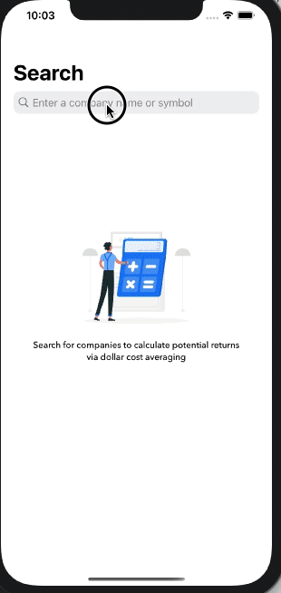

<h1>Financial APP</h1>

Users build a dollar cost averaging calculator to project potential returns for financial assets like stocks, equities & ETFs  

<h2>Externally Used Libraries</h2>

<a href = "https://cocoapods.org/pods/MBProgressHUD">MBProgressHUD</a>  is an iOS drop-in class that displays a translucent HUD with an indicator and/or labels while work is being done in a background thread. 

<a href = "https://cocoapods.org/pods/Loaf"> Loaf</a> is a Swifty Framework for Easy iOS Toasts.  

<h2>Screen Gif</h2>

